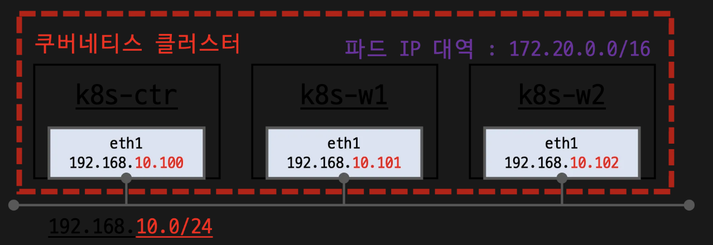

---


## 2주차 실습 환경 개요



- **기본 배기기포 가상 머신** : k8s-ctr, k8s-w1, k8s-w2
- **초기 프로비저닝** : kubeadm init, join 실행
- **Cilium CNI** 설치 상태로 배포 완료

---

## 실습 환경 배포 파일 작성

- **Vagrantfile** : 가상머신 정의, 부팅 시 초기 프로비저닝 설정
- **init_cfg.sh** : args 참고하여 설치
- **k8s-ctr.sh** : kubeadm init, Cilium CNI 설치, 편리성 설정(k, kc)
- **k8s-w.sh** : kubeadm join

```bash
mkdir cilium-lab && cd cilium-lab
curl -O https://raw.githubusercontent.com/gasida/vagrant-lab/refs/heads/main/cilium-study/2w/Vagrantfile
vagrant up
```

---

## 실습 환경 배포 및 초기 점검

```bash
# /etc/hosts 확인
cat /etc/hosts

# 각 워커 노드 접속 테스트
sshpass -p 'vagrant' ssh -o StrictHostKeyChecking=no vagrant@k8s-w1 hostname
sshpass -p 'vagrant' ssh -o StrictHostKeyChecking=no vagrant@k8s-w2 hostname

# 네트워크 인터페이스 확인
ifconfig | grep -iEA1 'eth[0-9]:'

# 클러스터 정보 확인
kubectl cluster-info
kubectl cluster-info dump | grep -m 2 -E "cluster-cidr|service-cluster-ip-range"
kubectl describe cm -n kube-system kubeadm-config
kubectl describe cm -n kube-system kubelet-config

# 노드 정보 : 상태, INTERNAL-IP 확인
kubectl get node -owide

# 노드별 kubeadm-flags.env 정보 확인
cat /var/lib/kubelet/kubeadm-flags.env
for i in w1 w2 ; do echo ">> node : k8s-$i <<"; sshpass -p 'vagrant' ssh vagrant@k8s-$i cat /var/lib/kubelet/kubeadm-flags.env ; echo; done

# 파드 정보 : 상태, 파드 IP 확인
kubectl get nodes -o jsonpath='{range .items[*]}{.metadata.name}{"\t"}{.spec.podCIDR}{"\n"}{end}'
kubectl get ciliumnode -o json | grep podCIDRs -A2
kubectl get pod -A -owide

# iptables 확인
iptables-save
iptables -t nat -S
iptables -t filter -S
iptables -t mangle -S
```


---

## k8s-ctr - Cilium 설치 정보 확인

```bash
# cilium 상태 확인
which cilium
cilium status
cilium config view
kubectl get cm -n kube-system cilium-config -o json | jq

# 상세 상태/메트릭
kubectl exec -n kube-system -c cilium-agent -it ds/cilium -- cilium-dbg config
kubectl exec -n kube-system -c cilium-agent -it ds/cilium -- cilium-dbg status --verbose
kubectl exec -n kube-system -c cilium-agent -it ds/cilium -- cilium-dbg metrics list

# 엔드포인트 정보
kubectl get ciliumendpoints -A

# 모니터링
kubectl exec -n kube-system -c cilium-agent -it ds/cilium -- cilium-dbg monitor
kubectl exec -n kube-system -c cilium-agent -it ds/cilium -- cilium-dbg monitor -v
kubectl exec -n kube-system -c cilium-agent -it ds/cilium -- cilium-dbg monitor -v -v

## 엔드포인트별 모니터링/드롭/HEX
kubectl exec -n kube-system -c cilium-agent -it ds/cilium -- cilium-dbg monitor --related-to=<id>
kubectl exec -n kube-system -c cilium-agent -it ds/cilium -- cilium-dbg monitor --type drop
kubectl exec -n kube-system -c cilium-agent -it ds/cilium -- cilium-dbg monitor -v -v --hex
```

## Layer 7 모니터링

```bash
# Layer 7 트래픽 모니터링
kubectl exec -n kube-system -c cilium-agent -it ds/cilium -- cilium-dbg monitor -v --type l7
```

---

## 1. Network Observability with Hubble

### Hubble 소개
- **Cilium의 관측 가능성 플랫폼**
- **네트워크 트래픽 가시성** 제공
- **실시간 플로우 모니터링** 기능

### Setting up Hubble Observability

#### 📋 설치 전 확인

```bash
# Cilium 상태 확인
cilium status
cilium config view | grep -i hubble
kubectl get cm -n kube-system cilium-config -o json | jq

# 기존 Secret 및 포트 확인
kubectl get secret -n kube-system | grep -iE 'cilium-ca|hubble'
ss -tnlp | grep -iE 'cilium|hubble' | tee before.txt
```

#### 🚀 Hubble 설치

##### 설치방안 1: Helm을 통한 완전 설치

```bash
# hubble 활성화, 메트릭 설정 등등
helm upgrade cilium cilium/cilium --namespace kube-system --reuse-values \
--set hubble.enabled=true \
--set hubble.relay.enabled=true \
--set hubble.ui.enabled=true \
--set hubble.ui.service.type=NodePort \
--set hubble.ui.service.nodePort=31234 \
--set hubble.export.static.enabled=true \
--set hubble.export.static.filePath=/var/run/cilium/hubble/events.log \
--set prometheus.enabled=true \
--set operator.prometheus.enabled=true \
--set hubble.metrics.enableOpenMetrics=true \
--set hubble.metrics.enabled="{dns,drop,tcp,flow,port-distribution,icmp,httpV2:exemplars=true;labelsContext=source_ip\,source_namespace\,source_workload\,destination_ip\,destination_namespace\,destination_workload\,traffic_direction}"

# 설치방안 2 : hubble 활성화
cilium hubble enable
cilium hubble enable --ui


# This is required for Relay to operate correctly.
cilium status
Hubble Relay:       OK

#
cilium config view | grep -i hubble
kubectl get cm -n kube-system cilium-config -o json | grep -i hubble

#
kubectl get secret -n kube-system | grep -iE 'cilium-ca|hubble'

# # Enabling Hubble requires the TCP port 4244 to be open on all nodes running Cilium.
ss -tnlp | grep -iE 'cilium|hubble' | tee after.txt
vi -d before.txt after.txt
for i in w1 w2 ; do echo ">> node : k8s-$i <<"; sshpass -p 'vagrant' ssh vagrant@k8s-$i sudo ss -tnlp |grep 4244 ; echo; done

#
kubectl get pod -n kube-system -l k8s-app=hubble-relay
kc describe pod -n kube-system -l k8s-app=hubble-relay

kc get svc,ep -n kube-system hubble-relay
...
NAME                     ENDPOINTS           AGE
endpoints/hubble-relay   172.20.1.202:4245   7m54s


# hubble-relay 는 hubble-peer 의 서비스(ClusterIP :443)을 통해 모든 노드의 :4244에 요청 가져올 수 있음
kubectl get cm -n kube-system
kubectl describe cm -n kube-system hubble-relay-config
...
cluster-name: default
peer-service: "hubble-peer.kube-system.svc.cluster.local.:443"
listen-address: :4245
...

#
kubectl get svc,ep -n kube-system hubble-peer
NAME                  TYPE        CLUSTER-IP    EXTERNAL-IP   PORT(S)   AGE
service/hubble-peer   ClusterIP   10.96.145.0   <none>        443/TCP   5h55m

NAME                    ENDPOINTS                                                     AGE
endpoints/hubble-peer   192.168.10.100:4244,192.168.10.101:4244,192.168.10.102:4244   5h55m

#
kc describe pod -n kube-system -l k8s-app=hubble-ui
...
Containers:
frontend:
...
backend:
...

kc describe cm -n kube-system hubble-ui-nginx
...

#
kubectl get svc,ep -n kube-system hubble-ui
NAME                TYPE       CLUSTER-IP    EXTERNAL-IP   PORT(S)        AGE
service/hubble-ui   NodePort   10.96.66.67   <none>        80:31234/TCP   17m

NAME                  ENDPOINTS          AGE
endpoints/hubble-ui   172.20.2.70:8081   17m

# hubble ui 웹 접속 주소 확인
NODEIP=$(ip -4 addr show eth1 | grep -oP '(?<=inet\s)\d+(\.\d+){3}')
echo -e "http://$NODEIP:31234"
```

- Hubble Client 설치
- - **Validate Hubble API Access**
    - In order to **access** the **Hubble API**, create a port forward to the Hubble service from **your local machine.**
    - This will allow you to connect the **Hubble client** to the local port `4245` and access the **Hubble Relay service** in your Kubernetes cluster.
    - For more information on this method, see [Use Port Forwarding to Access Application in a Cluster](https://kubernetes.io/docs/tasks/access-application-cluster/port-forward-access-application-cluster/).
```
  #
  cilium hubble port-forward&
  Hubble Relay is available at 127.0.0.1:4245
  
  ss -tnlp | grep 4245
  
  # Now you can validate that you can access the Hubble API via the installed CLI
  hubble status
  Healthcheck (via localhost:4245): Ok
  Current/Max Flows: 12,285/12,285 (100.00%)
  Flows/s: 41.20
  
  # hubble (api) server 기본 접속 주소 확인
  hubble config view 
  ...
  port-forward-port: "4245"
  server: localhost:4245
  ...
  
  # (옵션) 현재 k8s-ctr 가상머신이 아닌, 자신의 PC에 kubeconfig 설정 후 아래 --server 옵션을 통해 hubble api server 사용해보자!
  hubble help status | grep 'server string'
        --server string                 Address of a Hubble server. Ignored when --input-file or --port-forward is provided. (default "localhost:4245")
  
  # You can also query the flow API and look for flows
  kubectl get ciliumendpoints.cilium.io -n kube-system # SECURITY IDENTITY
  hubble observe
  hubble observe -h
  hubble observe -f
```
- Cilium Agent 단축키 지정
```
[- Cilium Agent 단축키 지정ㄹㅇㄴㅁㄹㅇㄴㅁㄹㅇㄴㅁㄹ](<# cilium 파드 이름
export CILIUMPOD0=$(kubectl get -l k8s-app=cilium pods -n kube-system --field-selector spec.nodeName=k8s-ctr -o jsonpath='{.items[0].metadata.name}')
export CILIUMPOD1=$(kubectl get -l k8s-app=cilium pods -n kube-system --field-selector spec.nodeName=k8s-w1  -o jsonpath='{.items[0].metadata.name}')
export CILIUMPOD2=$(kubectl get -l k8s-app=cilium pods -n kube-system --field-selector spec.nodeName=k8s-w2  -o jsonpath='{.items[0].metadata.name}')
echo $CILIUMPOD0 $CILIUMPOD1 $CILIUMPOD2

# 단축키(alias) 지정
alias c0="kubectl exec -it $CILIUMPOD0 -n kube-system -c cilium-agent -- cilium"
alias c1="kubectl exec -it $CILIUMPOD1 -n kube-system -c cilium-agent -- cilium"
alias c2="kubectl exec -it $CILIUMPOD2 -n kube-system -c cilium-agent -- cilium"

alias c0bpf="kubectl exec -it $CILIUMPOD0 -n kube-system -c cilium-agent -- bpftool"
alias c1bpf="kubectl exec -it $CILIUMPOD1 -n kube-system -c cilium-agent -- bpftool"
alias c2bpf="kubectl exec -it $CILIUMPOD2 -n kube-system -c cilium-agent -- bpftool"


# endpoint
c0 endpoint list
c0 endpoint list -o json
c1 endpoint list
c2 endpoint list

c1 endpoint get %3Cid%3E
c1 endpoint log <id>

## Enable debugging output on the cilium-dbg monitor for this endpoint
c1 endpoint config <id> Debug=true


# monitor
c1 monitor
c1 monitor -v
c1 monitor -v -v

## Filter for only the events related to endpoint
c1 monitor --related-to=<id>

## Show notifications only for dropped packet events
c1 monitor --type drop

## Don’t dissect packet payload, display payload in hex information
c1 monitor -v -v --hex

## Layer7
c1 monitor -v --type l7


# Manage IP addresses and associated information - IP List
c0 ip list

# IDENTITY :  1(host), 2(world), 4(health), 6(remote), 파드마다 개별 ID
c0 ip list -n

# Retrieve information about an identity
c0 identity list

# 엔드포인트 기준 ID
c0 identity list --endpoints

# 엔드포인트 설정 확인 및 변경
c0 endpoint config <엔트포인트ID>

# 엔드포인트 상세 정보 확인
c0 endpoint get <엔트포인트ID>

# 엔드포인트 로그 확인
c0 endpoint log <엔트포인트ID>

# Show bpf filesystem mount details
c0 bpf fs show

# bfp 마운트 폴더 확인
tree /sys/fs/bpf


# Get list of loadbalancer services
c0 service list
c1 service list
c2 service list

## Or you can get the loadbalancer information using bpf list
c0 bpf lb list
c1 bpf lb list
c2 bpf lb list

## List reverse NAT entries
c1 bpf lb list --revnat
c2 bpf lb list --revnat


# List connection tracking entries
c0 bpf ct list global
c1 bpf ct list global
c2 bpf ct list global

# Flush connection tracking entries
c0 bpf ct flush
c1 bpf ct flush
c2 bpf ct flush


# List all NAT mapping entries
c0 bpf nat list
c1 bpf nat list
c2 bpf nat list

# Flush all NAT mapping entries
c0 bpf nat flush
c1 bpf nat flush
c2 bpf nat flush

# Manage the IPCache mappings for IP/CIDR <-> Identity
c0 bpf ipcache list# Display cgroup metadata maintained by Cilium
c0 cgroups list
c1 cgroups list
c2 cgroups list


# List all open BPF maps
c0 map list
c1 map list --verbose
c2 map list --verbose

c1 map events cilium_lb4_services_v2
c1 map events cilium_lb4_reverse_nat
c1 map events cilium_lxc
c1 map events cilium_ipcache


# List all metrics
c1 metrics list


# List contents of a policy BPF map : Dump all policy maps
c0 bpf policy get --all
c1 bpf policy get --all -n
c2 bpf policy get --all -n


# Dump StateDB contents as JSON
c0 statedb dump


#
c0 shell -- db/show devices
c1 shell -- db/show devices
c2 shell -- db/show devices>)
```

- Getting Started with the Star Wars Demo & Hubble/UI
  - Deploy the Demo Application
![[Pasted image 20250725164406.png]]
- 스타워즈에서 영감을 받은 예제에서는 데스스타, 타이파이터, 엑스윙의 세 가지 마이크로서비스 애플리케이션이 있습니다.
- 데스스타는 포트 80에서 HTTP 웹서비스를 실행하며, 이 서비스는 두 개의 포드 복제본에 걸쳐 데스스타에 대한 요청을 로드 밸런싱하는 Kubernetes 서비스로 노출됩니다.
- 데스스타 서비스는 제국의 우주선에 착륙 서비스를 제공하여 착륙 포트를 요청할 수 있도록 합니다.
- 타이파이터 포드는 일반적인 제국 선박의 착륙 요청 클라이언트 서비스를 나타내며, 엑스윙은 동맹 선박의 유사한 서비스를 나타냅니다.
- 데스스타 착륙 서비스에 대한 접근 제어를 위한 다양한 보안 정책을 테스트할 수 있도록 존재합니다.
```
#
kubectl apply -f https://raw.githubusercontent.com/cilium/cilium/1.17.6/examples/minikube/http-sw-app.yaml
service/deathstar created
deployment.apps/deathstar created
pod/tiefighter created
pod/xwing created

# 파드 라벨 labels 확인
kubectl get pod --show-labels
NAME                        READY   STATUS    RESTARTS   AGE   LABELS
deathstar-8c4c77fb7-9klws   1/1     Running   0          29s   app.kubernetes.io/name=deathstar,class=deathstar,org=empire,pod-template-hash=8c4c77fb7
deathstar-8c4c77fb7-kkwds   1/1     Running   0          29s   app.kubernetes.io/name=deathstar,class=deathstar,org=empire,pod-template-hash=8c4c77fb7
tiefighter                  1/1     Running   0          29s   app.kubernetes.io/name=tiefighter,class=tiefighter,org=empire
xwing                       1/1     Running   0          29s   app.kubernetes.io/name=xwing,class=xwing,org=alliance

kubectl get deploy,svc,ep deathstar
NAME                        READY   UP-TO-DATE   AVAILABLE   AGE
deployment.apps/deathstar   2/2     2            2           114s

NAME                TYPE        CLUSTER-IP      EXTERNAL-IP   PORT(S)   AGE
service/deathstar   ClusterIP   10.96.154.223   <none>        80/TCP    114s

NAME                  ENDPOINTS                      AGE
endpoints/deathstar   172.20.1.34:80,172.20.2.1:80   114s

#
kubectl get ciliumendpoints.cilium.io -A
kubectl get ciliumidentities.cilium.io

# in a multi-node installation, only the ones running on the same node will be listed
kubectl exec -it -n kube-system ds/cilium -c cilium-agent -- cilium endpoint list
c0 endpoint list
c1 endpoint list
c2 endpoint list # 현재 ingress/egress 에 정책(Policy) 없음! , Labels 정보 확인
ENDPOINT   POLICY (ingress)   POLICY (egress)   IDENTITY   LABELS (source:key[=value])
...
1579       Disabled           Disabled          318        k8s:app.kubernetes.io/name=deathstar                                                172.20.2.1    ready   
                                                           k8s:class=deathstar                                                                                       
                                                           k8s:io.cilium.k8s.namespace.labels.kubernetes.io/metadata.name=default                                    
                                                           k8s:io.cilium.k8s.policy.cluster=default                                                                  
                                                           k8s:io.cilium.k8s.policy.serviceaccount=default                                                           
                                                           k8s:io.kubernetes.pod.namespace=default                                                                   
                                                           k8s:org=empire   
```
- **Check Current Access**
    - 데스스타 서비스의 관점에서 보면, org= empire 라벨이 부착된 선박만 연결하여 착륙을 요청할 수 있습니다.
    - 우리는 규칙을 시행하지 않기 때문에 Xwing과 타이파이터 모두 착륙을 요청할 수 있습니다. 이를 테스트하려면 아래 명령을 사용하세요.
```
# 아래 출력에서 xwing 와 tiefighter 의 IDENTITY 메모
c1 endpoint list | grep -iE 'xwing|tiefighter|deathstar'
c2 endpoint list | grep -iE 'xwing|tiefighter|deathstar'
XWINGID=17141
TIEFIGHTERID=56716
DEATHSTARID=8113

# 모니터링 준비 : 터미널 3개, 단축키 설정
## 각각 monitor 확인
c0 monitor -v -v
c1 monitor -v -v
c2 monitor -v -v

# 모니터링 준비 : 터미널 1개
hubble observe -f

XWINGID=50633
TIEFIGHTERID=19274
DEATHSTARID=318

hubble observe -f --from-identity $XWINGID
hubble observe -f --protocol udp --from-identity $XWINGID
hubble observe -f --protocol tcp --from-identity $XWINGID

hubble observe -f --protocol tcp --from-identity $DEATHSTARID


# 호출 시도 1
kubectl exec xwing -- curl -s -XPOST deathstar.default.svc.cluster.local/v1/request-landing
while true; do kubectl exec xwing -- curl -s -XPOST deathstar.default.svc.cluster.local/v1/request-landing ; sleep 5 ; done


# 호출 시도 2
kubectl exec tiefighter -- curl -s -XPOST deathstar.default.svc.cluster.local/v1/request-landing
while true; do kubectl exec tiefighter -- curl -s -XPOST deathstar.default.svc.cluster.local/v1/request-landing ; sleep 5 ; done

## 모니터링
hubble observe -f --protocol tcp --from-identity $TIEFIGHTERID
hubble observe -f --protocol tcp --from-identity $DEATHSTARID

```
- Apply an L3/L4 Policy
![[Pasted image 20250725171932.png]]
- Cilium을 사용할 때 보안 정책을 정의할 때 엔드포인트 IP 주소는 중요하지 않습니다. 대신 **포드에 할당된 레이블**을 사용하여 **보안 정책을 정의**할 수 있습니다. 정책은 클러스터 내에서 실행 중이거나 실행 중인 위치에 관계없이 레이블을 기반으로 올바른 포드에 적용됩니다.
- **데스스타 착륙 요청**을 라벨이 있는 선박(org=empire)으로만 **제한**하는 **기본 정책**부터 시작하겠습니다. 이렇게 하면 org=empire 라벨이 없는 선박은 데스스타 서비스와 연결조차 할 수 없습니다. 이 정책은 IP 프로토콜(네트워크 계층 3)과 TCP 프로토콜(네트워크 계층 4)에만 적용되는 간단한 정책이므로 흔히 **L3/L4 네트워크 보안 정책**이라고 합니다.
- 참고: 실리움은 **상태별 연결 추적**을 수행합니다. 이는 정책이 프론트엔드가 백엔드에 도달할 수 있도록 허용하면, 동일한 TCP/UDP 연결 내에서 백엔드 응답의 일부인 모든 **필수 응답 패킷이 자동**으로 프론트엔드에 도달하도록 **허용**한다는 것을 의미합니다. _**→ 리턴 패킷 자동 허용!**_
```
# CiliumNetworkPolicy
## CiliumNetworkPolicys는 "endpointSelector"를 사용하여 팟 레이블에서 정책이 적용되는 소스와 목적지를 식별합니다. 
## 아래 정책은 TCP 포트 80에서 레이블(org=empire)이 있는 모든 팟에서 레이블(org=empire, class=deathstar)이 있는 데스스타 팟으로 전송되는 트래픽을 화이트리스트로 작성합니다.
apiVersion: "cilium.io/v2"
kind: CiliumNetworkPolicy
metadata:
  name: "rule1"
spec:
  description: "L3-L4 policy to restrict deathstar access to empire ships only"
  endpointSelector:
    matchLabels:
      org: empire
      class: deathstar
  ingress:
  - fromEndpoints:
    - matchLabels:
        org: empire
    toPorts:
    - ports:
      - port: "80"
        protocol: TCP

kubectl apply -f https://raw.githubusercontent.com/cilium/cilium/1.17.6/examples/minikube/sw_l3_l4_policy.yaml
kubectl get cnp
kubectl get cnp -o json | jq

# 모니터링
hubble observe -f --type drop

# 호출 시도 1 
kubectl exec xwing -- curl -s -XPOST deathstar.default.svc.cluster.local/v1/request-landing --connect-timeout 2


# 모니터링 
hubble observe -f --protocol tcp --from-identity $DEATHSTARID

# 호출 시도 2
kubectl exec tiefighter -- curl -s -XPOST deathstar.default.svc.cluster.local/v1/request-landing

```
- Inspecting the Policy
```
# deathstar 에 ingress 에 policy 활성화 확인
c0 endpoint list
c1 endpoint list
c2 endpoint list
ENDPOINT   POLICY (ingress)   POLICY (egress)   IDENTITY   LABELS (source:key[=value]) 
...
1579       Enabled            Disabled          318        k8s:app.kubernetes.io/name=deathstar                                                172.20.2.1    ready   
                                                           k8s:class=deathstar                                                                                       
                                                           k8s:io.cilium.k8s.namespace.labels.kubernetes.io/metadata.name=default                                    
                                                           k8s:io.cilium.k8s.policy.cluster=default                                                                  
                                                           k8s:io.cilium.k8s.policy.serviceaccount=default                                                           
                                                           k8s:io.kubernetes.pod.namespace=default                                                                   
                                                           k8s:org=empire  
                                                           
#
kc describe cnp rule1

```

- Life of a Packet : L7 동작 처리는 cilium-envoy 데몬셋이 담당
![[Pasted image 20250725172102.png]]
```
#
kubectl get ds -n kube-system
NAME           DESIRED   CURRENT   READY   UP-TO-DATE   AVAILABLE   NODE SELECTOR            AGE
cilium         3         3         3       3            3           kubernetes.io/os=linux   3h38m
cilium-envoy   3         3         3       3            3           kubernetes.io/os=linux   3h38m

kubectl get pod -n kube-system -l k8s-app=cilium-envoy -owide
NAME                 READY   STATUS    RESTARTS   AGE     IP               NODE      NOMINATED NODE   READINESS GATES
cilium-envoy-8427n   1/1     Running   0          3h38m   192.168.10.100   k8s-ctr   <none>           <none>
cilium-envoy-8rzsb   1/1     Running   0          3h36m   192.168.10.101   k8s-w1    <none>           <none>
cilium-envoy-vkqw6   1/1     Running   0          3h35m   192.168.10.102   k8s-w2    <none>           <none>

#
kc describe ds -n kube-system cilium-envoy
...
    Mounts:
      /sys/fs/bpf from bpf-maps (rw)
      /var/run/cilium/envoy/ from envoy-config (ro)
      /var/run/cilium/envoy/artifacts from envoy-artifacts (ro)
      /var/run/cilium/envoy/sockets from envoy-sockets (rw
   ...
   envoy-config:
    Type:      ConfigMap (a volume populated by a ConfigMap)
    Name:      cilium-envoy-config
    Optional:  false
...


kubectl exec -it -n kube-system ds/cilium -c cilium-agent -- ss -xnp | grep -i -envoy
u_str ESTAB 0      0                                                  /var/run/cilium/envoy/sockets/xds.sock 32644            * 32610 users:(("cilium-agent",pid=1,fd=64))
u_str ESTAB 0      0                                                /var/run/cilium/envoy/sockets/admin.sock 29697            * 29345
u_str ESTAB 0      0                                                /var/run/cilium/envoy/sockets/admin.sock 29340            * 28672

kc describe cm -n kube-system cilium-envoy-config
...
Data
====
bootstrap-config.json:
----
{"admin":{"address":{"pipe":{"path":"/var/run/cilium/envoy/sockets/admin.sock"}}}...
...

```
- Apply and Test HTTP-aware L7 Policy
![[Pasted image 20250725172147.png]]

- 위의 간단한 시나리오에서는 tiefighter / xwing에게 데스스타 API에 대한 전체 액세스 권한을 부여하거나 아예 액세스 권한을 부여하지 않는 것으로 충분했습니다. 그러나 마이크로서비스 간에 가장 강력한 보안(즉, 최소 권한 격리를 강제하는 것)을 제공하기 위해서는 데스스타 API를 호출하는 각 서비스가 **합법적인 운영에 필요한 HTTP 요청 세트만 수행**하도록 제한해야 합니다.
- 예를 들어, 데스스타 서비스가 임의의 제국 선박이 **호출해서는 안 되는 일부 유지보수 API를 노출**한다고 가정해 보겠습니다.
```
# 모니터링 >> Layer3/4 에서는 애플리케이션 상태를 확인 할 수 없음!
hubble observe -f --protocol tcp --from-identity $DEATHSTARID

# 호출해서는 안 되는 일부 유지보수 API를 노출
kubectl exec tiefighter -- curl -s -XPUT deathstar.default.svc.cluster.local/v1/exhaust-port

```

- L7 Policy with Cilium and Kubernetes
  - Cilium은 HTTP 계층(즉, L7) 정책을 적용하여 타이파이터가 도달할 수 있는 URL을 제한할 수 있습니다. 다음은 타이파이터를 POST /v1/요청-랜딩 API 호출만 수행하도록 제한하고 다른 모든 호출(PUT /v1/배기포트 포함)은 허용하지 않는 정책 파일의 예입니다.
```
# 기존 rule1 정책을 업데이트 해서 사용
apiVersion: "cilium.io/v2"
kind: CiliumNetworkPolicy
metadata:
  name: "rule1"
spec:
  description: "L7 policy to restrict access to specific HTTP call"
  endpointSelector:
    matchLabels:
      org: empire
      class: deathstar
  ingress:
  - fromEndpoints:
    - matchLabels:
        org: empire
    toPorts:
    - ports:
      - port: "80"
        protocol: TCP
      rules:
        http:
        - method: "POST"
          path: "/v1/request-landing"

# Update the existing rule to apply L7-aware policy to protect deathstar using:
kubectl apply -f https://raw.githubusercontent.com/cilium/cilium/1.17.6/examples/minikube/sw_l3_l4_l7_policy.yaml
kubectl get cnp
kc describe cnp
c0 policy get


# 모니터링 : 파드 이름 지정
hubble observe -f --pod deathstar --protocol http
Jul 20 01:28:02.184: default/tiefighter:59020 (ID:19274) -> default/deathstar-8c4c77fb7-9klws:80 (ID:318) http-request FORWARDED (HTTP/1.1 POST http://deathstar.default.svc.cluster.local/v1/request-landing)
Jul 20 01:28:02.190: default/tiefighter:59020 (ID:19274) <- default/deathstar-8c4c77fb7-9klws:80 (ID:318) http-response FORWARDED (HTTP/1.1 200 6ms (POST http://deathstar.default.svc.cluster.local/v1/request-landing))

# We can now re-run the same test as above, but we will see a different outcome
kubectl exec tiefighter -- curl -s -XPOST deathstar.default.svc.cluster.local/v1/request-landing

```

```
# 모니터링 : 파드 이름 지정
hubble observe -f --pod deathstar --verdict DROPPED
Jul 20 01:31:21.248: default/tiefighter:44734 (ID:19274) -> default/deathstar-8c4c77fb7-9klws:80 (ID:318) http-request DROPPED (HTTP/1.1 PUT http://deathstar.default.svc.cluster.local/v1/exhaust-port)

혹은
c1 monitor -v --type l7
<- Request http from 3845 ([k8s:app.kubernetes.io/name=tiefighter k8s:class=tiefighter k8s:io.cilium.k8s.namespace.labels.kubernetes.io/metadata.name=default k8s:io.cilium.k8s.policy.cluster=default k8s:io.cilium.k8s.policy.serviceaccount=default k8s:io.kubernetes.pod.namespace=default k8s:org=empire]) to 871 ([k8s:app.kubernetes.io/name=deathstar k8s:class=deathstar k8s:io.cilium.k8s.namespace.labels.kubernetes.io/metadata.name=default k8s:io.cilium.k8s.policy.cluster=default k8s:io.cilium.k8s.policy.serviceaccount=default k8s:io.kubernetes.pod.namespace=default k8s:org=empire]), identity 19274->318, verdict Denied PUT http://deathstar.default.svc.cluster.local/v1/exhaust-port => 0
<- Response http to 3845 ([k8s:app.kubernetes.io/name=tiefighter k8s:class=tiefighter k8s:io.cilium.k8s.namespace.labels.kubernetes.io/metadata.name=default k8s:io.cilium.k8s.policy.cluster=default k8s:io.cilium.k8s.policy.serviceaccount=default k8s:io.kubernetes.pod.namespace=default k8s:org=empire]) from 871 ([k8s:app.kubernetes.io/name=deathstar k8s:class=deathstar k8s:io.cilium.k8s.namespace.labels.kubernetes.io/metadata.name=default k8s:io.cilium.k8s.policy.cluster=default k8s:io.cilium.k8s.policy.serviceaccount=default k8s:io.kubernetes.pod.namespace=default k8s:org=empire]), identity 318->19274, verdict Forwarded PUT http://deathstar.default.svc.cluster.local/v1/exhaust-port => 403
c2 monitor -v --type l7


# We can now re-run the same test as above, but we will see a different outcome
kubectl exec tiefighter -- curl -s -XPUT deathstar.default.svc.cluster.local/v1/exhaust-port
Access denied


# 모니터링 : 파드 이름 지정
hubble observe -f --pod xwing

# 호출 시도 : 위와 아래 실행 종료의 차이점을 이해해보자!
kubectl exec xwing -- curl -s -XPOST deathstar.default.svc.cluster.local/v1/request-landing --connect-timeout 2

```
- 다음 실습을 위해 리소스 삭제
```
# 다음 실습을 위해 리소스 삭제
kubectl delete -f https://raw.githubusercontent.com/cilium/cilium/1.17.6/examples/minikube/http-sw-app.yaml
kubectl delete cnp rule1

# 삭제 확인
kubectl get cnp

```

- Configuring Hubble exporter : 흐름 로그
  - Hubble Exporter는 나중에 사용할 수 있도록 **Hubble flows 로그를 파일**에 저장할 수 있는 cilium-agent의 기능입니다.
  - Hubble Exporter는 file rotation, size limits, filters, field masks를 지원합니다.
  - **Hubble Exporter 설정** ← Hubble 설치 때 같이 적용되어 있음
```
# 설정 : 아래 설정할 필요 없음
helm upgrade cilium cilium/cilium --namespace kube-system --reuse-values \
   --set hubble.enabled=true \
   --set hubble.export.static.enabled=true \
   --set hubble.export.static.filePath=/var/run/cilium/hubble/events.log

kubectl -n kube-system rollout status ds/cilium


# 확인
kubectl get cm -n kube-system cilium-config -o json | grep hubble-export
cilium config view | grep hubble-export
hubble-export-allowlist                           
hubble-export-denylist                            
hubble-export-fieldmask                           
hubble-export-file-max-backups   # number of rotated Hubble export files to keep. (default 5)
hubble-export-file-max-size-mb   # size in MB at which to rotate the Hubble export file. (default 10)
hubble-export-file-path          # file path of target log file. (default /var/run/cilium/hubble/events.log)

# Verify that flow logs are stored in target files
kubectl -n kube-system exec ds/cilium -- tail -f /var/run/cilium/hubble/events.log
kubectl -n kube-system exec ds/cilium -- sh -c 'tail -f /var/run/cilium/hubble/events.log' | jq

```

- Performance tuning
  - Configuration options impacting performance of **Hubble exporter** include:
    - `hubble.export.static.allowList`: specify an **allowlist** as JSON encoded FlowFilters to Hubble exporter.
    - `hubble.export.static.denyList`: specify a **denylist** as JSON encoded FlowFilters to Hubble exporter.
    - `hubble.export.static.fieldMask`: specify a **list** of **fields** to use for field masking in Hubble exporter.
  - Filters & Field mas
    - Field mask is a list of field names from the [flow proto](https://github.com/cilium/cilium/blob/main/api/v1/flow/flow.proto) definition.
```
# You can use hubble CLI to generated required filters (see Specifying Raw Flow Filters for more examples).
# For example, to filter flows with verdict DENIED or ERROR, run:
hubble observe --verdict DROPPED --verdict ERROR --print-raw-filters
allowlist:
- '{"verdict":["DROPPED","ERROR"]}'


# To keep all information except pod labels:
hubble-export-fieldmask: time source.identity source.namespace source.pod_name destination.identity destination.namespace destination.pod_name source_service destination_service l4 IP ethernet l7 Type node_name is_reply event_type verdict Summary

# To keep only timestamp, verdict, ports, IP addresses, node name, pod name, and namespace:
hubble-export-fieldmask: time source.namespace source.pod_name destination.namespace destination.pod_name l4 IP node_name is_reply verdict


# 설정 방안 1 : Then paste the output to hubble-export-allowlist in cilium-config Config Map:
kubectl -n kube-system patch cm cilium-config --patch-file=/dev/stdin <<-EOF
data:
  hubble-export-allowlist: '{"verdict":["DROPPED","ERROR"]}'
  hubble-export-denylist: '{"source_pod":["kube-system/"]},{"destination_pod":["kube-system/"]}'
EOF

# 설정 방안 2 : helm 업그레이드
helm upgrade cilium cilium/cilium --version 1.17.6 \
   --set hubble.enabled=true \
   --set hubble.export.static.enabled=true \
   --set hubble.export.static.filePath=/var/run/cilium/hubble/events.log \
   --set hubble.export.static.allowList[0]='{"verdict":["DROPPED","ERROR"]}'
   --set hubble.export.static.denyList[0]='{"source_pod":["kube-system/"]}' \
   --set hubble.export.static.denyList[1]='{"destination_pod":["kube-system/"]}' \
   --set "hubble.export.static.fieldMask={time,source.namespace,source.pod_name,destination.namespace,destination.pod_name,l4,IP,node_name,is_reply,verdict,drop_reason_desc}"


# 확인
cilium config view | grep hubble-export
hubble-export-allowlist                           {"verdict":["DENIED","ERROR"]}
...

kubectl -n kube-system exec ds/cilium -- tail -f /var/run/cilium/hubble/events.log
{"flow":{"time":"2023-08-21T12:12:13.517394084Z","verdict":"DROPPED","IP":{"source":"fe80::64d8:8aff:fe72:fc14","destination":"ff02::2","ipVersion":"IPv6"},"l4":{"ICMPv6":{"type":133}},"source":{},"destination":{},"node_name":"kind-kind/kind-worker","drop_reason_desc":"INVALID_SOURCE_IP"},"node_name":"kind-kind/kind-worker","time":"2023-08-21T12:12:13.517394084Z"}
{"flow":{"time":"2023-08-21T12:12:18.510175415Z","verdict":"DROPPED","IP":{"source":"10.244.1.60","destination":"10.244.1.5","ipVersion":"IPv4"},"l4":{"TCP":{"source_port":44916,"destination_port":80,"flags":{"SYN":true}}},"source":{"namespace":"default","pod_name":"xwing"},"destination":{"namespace":"default","pod_name":"deathstar-7848d6c4d5-th9v2"},"node_name":"kind-kind/kind-worker","drop_reason_desc":"POLICY_DENIED"},"node_name":"kind-kind/kind-worker","time":"2023-08-21T12:12:18.510175415Z"}

```

- **Dynamic exporter configuration - [Docs](https://docs.cilium.io/en/stable/observability/hubble/configuration/export/#dynamic-exporter-configuration)
    - **Standard hubble exporter configuration**은 only one set of filters 허용하며 구성을 변경하려면 only one set of filters이 필요합니다.
    - **Dynamic flow logs**를 사용하면 여러 필터를 동시에 구성하고 출력을 별도의 파일에 저장할 수 있습니다. 또한 변경된 구성을 적용하기 위해 **실륨 포드 재시작이 필요하지 않습**니다.
    - **Dynamic Hubble Exporter**는 Config Map 속성으로 활성화됩니다. 파일 경로 값을 hubble-flowlogs-config-path로 설정할 때까지 비활성화됩니다.
```
# 설정 
helm upgrade cilium cilium/cilium --namespace kube-system --reuse-values \
   --set hubble.enabled=true \
   --set hubble.export.static.enabled=false \
   --set hubble.export.dynamic.enabled=true

kubectl -n kube-system rollout status ds/cilium


# 포드를 재시작할 필요 없이 흐름 로그 설정을 변경할 수 있습니다(구성 맵 전파 지연으로 인해 변경 사항을 60초 이내에 반영해야 함):
helm upgrade cilium cilium/cilium --version 1.17.6 \
   --set hubble.enabled=true \
   --set hubble.export.dynamic.enabled=true \
   --set hubble.export.dynamic.config.content[0].name=system \
   --set hubble.export.dynamic.config.content[0].filePath=/var/run/cilium/hubble/events-system.log \
   --set hubble.export.dynamic.config.content[0].includeFilters[0].source_pod[0]='kube_system/' \
   --set hubble.export.dynamic.config.content[0].includeFilters[1].destination_pod[0]='kube_system/'
```
- Dynamic flow logs can be configured with end property which means that it will automatically stop logging after specified date time. It supports the same field masking and filtering as static hubble exporter.
- For max output file size and backup files dynamic exporter reuses the same settings as static one: `hubble.export.fileMaxSizeMb` and `hubble.export.fileMaxBackups`

#### 2. Running Prometheus & Grafana
- **샘플 애플리케이션 배포 및 확인**
    - 샘플 애플리케이션 배포
```
# 샘플 애플리케이션 배포
cat << EOF | kubectl apply -f -
apiVersion: apps/v1
kind: Deployment
metadata:
  name: webpod
spec:
  replicas: 2
  selector:
    matchLabels:
      app: webpod
  template:
    metadata:
      labels:
        app: webpod
    spec:
      affinity:
        podAntiAffinity:
          requiredDuringSchedulingIgnoredDuringExecution:
          - labelSelector:
              matchExpressions:
              - key: app
                operator: In
                values:
                - sample-app
            topologyKey: "kubernetes.io/hostname"
      containers:
      - name: webpod
        image: traefik/whoami
        ports:
        - containerPort: 80
---
apiVersion: v1
kind: Service
metadata:
  name: webpod
  labels:
    app: webpod
spec:
  selector:
    app: webpod
  ports:
  - protocol: TCP
    port: 80
    targetPort: 80
  type: ClusterIP
EOF


# k8s-ctr 노드에 curl-pod 파드 배포
cat <<EOF | kubectl apply -f -
apiVersion: v1
kind: Pod
metadata:
  name: curl-pod
  labels:
    app: curl
spec:
  nodeName: k8s-ctr
  containers:
  - name: curl
    image: nicolaka/netshoot
    command: ["tail"]
    args: ["-f", "/dev/null"]
  terminationGracePeriodSeconds: 0
EOF
```
- 확인
```
# 배포 확인
kubectl get deploy,svc,ep webpod -owide
kubectl get endpointslices -l app=webpod
kubectl get ciliumendpoints
kubectl exec -it -n kube-system ds/cilium -c cilium-agent -- cilium-dbg endpoint list

# 통신 확인
kubectl exec -it curl-pod -- curl webpod | grep Hostname
kubectl exec -it curl-pod -- sh -c 'while true; do curl -s webpod | grep Hostname; sleep 1; done'

```

- **Install Prometheus & Grafana - [Docs](https://docs.cilium.io/en/stable/observability/grafana/)**
    - This is an example deployment that includes Prometheus and Grafana in a **single deployment**. - [Youtube](https://www.youtube.com/watch?v=DdWksYq5Pv4)
        - **Grafana**: A visualization dashboard with **Cilium Dashboard pre-loaded.**
        - **Prometheus**: a time series database and monitoring system.
        - This example deployment of Prometheus and Grafana will **automatically scrape** the **Cilium** and **Hubble metrics**.
```
#
kubectl apply -f https://raw.githubusercontent.com/cilium/cilium/1.17.6/examples/kubernetes/addons/prometheus/monitoring-example.yaml
configmap/grafana-config created
configmap/grafana-cilium-dashboard created
configmap/grafana-cilium-operator-dashboard created
configmap/grafana-hubble-dashboard created
configmap/grafana-hubble-l7-http-metrics-by-workload created
configmap/prometheus created

#
kubectl get deploy,pod,svc,ep -n cilium-monitoring
kubectl get cm -n cilium-monitoring
NAME                                         DATA   AGE
grafana-cilium-dashboard                     1      113s
grafana-cilium-operator-dashboard            1      113s
grafana-config                               3      113s
grafana-hubble-dashboard                     1      113s
grafana-hubble-l7-http-metrics-by-workload   1      113s
prometheus                                   1      113s

# 프로메테우스 서버 설정
kc describe cm -n cilium-monitoring prometheus

# 그라파나 서버 설정
kc describe cm -n cilium-monitoring grafana-config

# 그파라나 대시보드들 주입을 위한 설정
kc describe cm -n cilium-monitoring grafana-cilium-dashboard
kc describe cm -n cilium-monitoring grafana-hubble-dashboard
...
```

- **Deploy Cilium and Hubble with metrics enabled - [Docs](https://docs.cilium.io/en/stable/observability/grafana/#deploy-cilium-and-hubble-with-metrics-enabled)**
    - Cilium, Hubble, and Cilium Operator는 기본적으로 메트릭을 노출하지 않습니다.
            - 이러한 서비스에 대한 메트릭을 활성화하면 이러한 구성 요소가 실행 중인 클러스터의 모든 노드에 각각 **9962, 9965, 9963** 포트가 열립니다.
           -  Cilium, Hubble, and Cilium Operator의 메트릭은 모두 다음 헬름 값으로 서로 독립적으로 활성화할 수 있습니다        
        - `prometheus.enabled=true`: Enables metrics for `cilium-agent`.
        - `operator.prometheus.enabled=true`: Enables metrics for `cilium-operator`.
        - `hubble.metrics.enabled`: Enables the provided list of Hubble metrics.
            - For Hubble metrics to work, Hubble itself needs to be enabled with `hubble.enabled=true`.
            - See [Hubble exported metrics](https://docs.cilium.io/en/stable/observability/metrics/#hubble-exported-metrics) for the list of available Hubble metrics.
        
        _→ Refer to [Monitoring & Metrics](https://docs.cilium.io/en/stable/observability/metrics/#metrics) for more details about the individual metrics._
    - 메트릭 노출 설정 → 이미 되어 있음
```
# 이미 설정되어 있음
helm install cilium cilium/cilium --version 1.17.6 \
   --namespace kube-system \
   --set prometheus.enabled=true \
   --set operator.prometheus.enabled=true \
   --set hubble.enabled=true \
   --set hubble.metrics.enableOpenMetrics=true \
   --set hubble.metrics.enabled="{dns,drop,tcp,flow,port-distribution,icmp,httpV2:exemplars=true;labelsContext=source_ip\,source_namespace\,source_workload\,destination_ip\,destination_namespace\,destination_workload\,traffic_direction}"

# 호스트에 포트 정보 확인
ss -tnlp | grep -E '9962|9963|9965'
LISTEN 0      4096                *:9963             *:*    users:(("cilium-operator",pid=1488,fd=7)) # cilium-opeator 메트릭        
LISTEN 0      4096                *:9962             *:*    users:(("cilium-agent",pid=1894,fd=7))    # cilium 메트릭  
LISTEN 0      4096                *:9965             *:*    users:(("cilium-agent",pid=1894,fd=40))   # hubble 메트릭

for i in w1 w2 ; do echo ">> node : k8s-$i <<"; sshpass -p 'vagrant' ssh vagrant@k8s-$i sudo ss -tnlp | grep -E '9962|9963|9965' ; echo; done

```

- hostPC에서 **접속을 위한 NodePort 설정** 및 ‘**프로메테우스 & 그라파나**’ **웹 접속 확인 & 간단 쿼리문 알아보기!
  - hostPC에서 접속을 위한 NodePort 설정
```
#
kubectl get svc -n cilium-monitoring
NAME         TYPE        CLUSTER-IP      EXTERNAL-IP   PORT(S)    AGE
grafana      ClusterIP   10.96.212.137   <none>        3000/TCP   6m36s
prometheus   ClusterIP   10.96.240.147   <none>        9090/TCP   6m36s

# NodePort 설정
kubectl patch svc -n cilium-monitoring prometheus -p '{"spec": {"type": "NodePort", "ports": [{"port": 9090, "targetPort": 9090, "nodePort": 30001}]}}'
kubectl patch svc -n cilium-monitoring grafana -p '{"spec": {"type": "NodePort", "ports": [{"port": 3000, "targetPort": 3000, "nodePort": 30002}]}}'

# 확인
kubectl get svc -n cilium-monitoring
NAME         TYPE       CLUSTER-IP      EXTERNAL-IP   PORT(S)          AGE
grafana      NodePort   10.96.212.137   <none>        3000:30002/TCP   14m
prometheus   NodePort   10.96.240.147   <none>        9090:30001/TCP   14m

# 접속 주소 확인
echo "http://192.168.10.100:30001"  # prometheus
echo "http://192.168.10.100:30002"  # grafana

```
